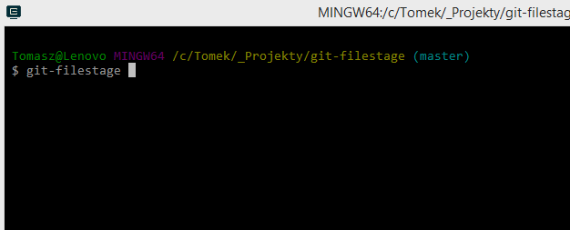

# git-filestage

Simple tool to stage and unstage whole files.

## Why I wrote this piece of software?

I want to have my commits clean.
They should contains only the code that fix the problem which is written in commite message.
Sometimes I make more changes, so I have to split my work to 2 or more commits.
Mostly I have to type long paths to files like: `src\projectName\moduleName\someFolder\anotherFolderName\File.cs`

I just want to quick select files and add them to staging area.
I also don't want switch from console to some GUI app.

## Installation

	dotnet tool install -g git-filestage

## Features
- Add whole selected file to staging area.
- Unstage the selected file.
- Checkout selected file to discard made changes.

## Keyboard shortcuts

| Shortcut          | Description                                                                                                                                                                                           |
|-------------------|-------------------------------------------------------------------------------------------------------------------------------------------------------------------------------------------------------|
| <kbd>↑</kbd>      | Select the previous file.                                                                                                                                                                             |
| <kbd>↓</kbd>      | Select the next file.                                                                                                                                                                                 |
| <kbd>ENTER</kbd>  | - When file is in working directory, will be added to staging area.  - When file is in staging area, will be unstaged.  - When file is untracked, start tracked file and added to staging area. |
| <kbd>R</kbd>      | Checkout selected file to discard made changes.                                                                                                                                                       |
| <kbd>ESCAPE</kbd> | Close application, return to command line.                                                                                                                                                            |
| <kbd>Q</kbd>      | Close application, return to command line.                                                                                                                                                            |
